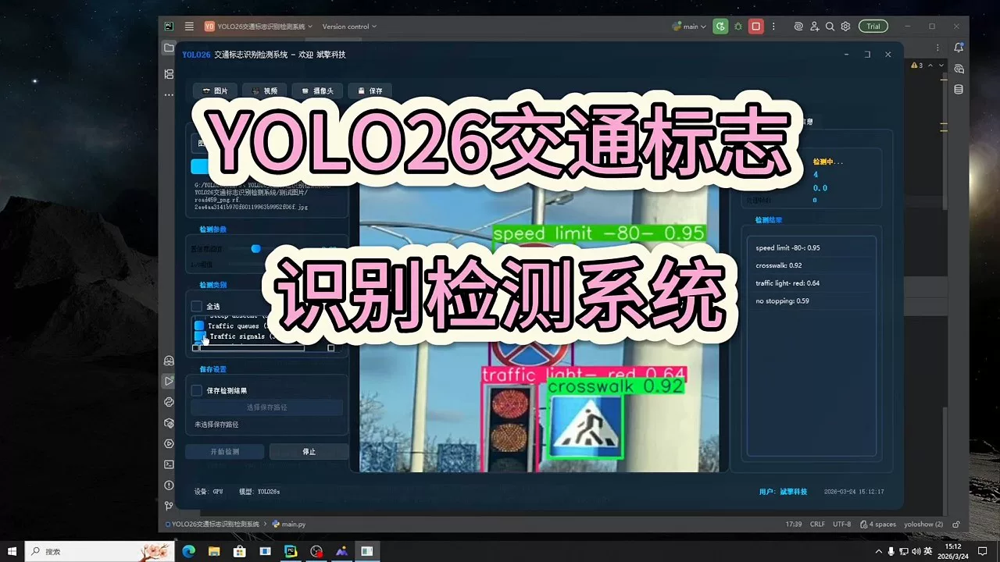
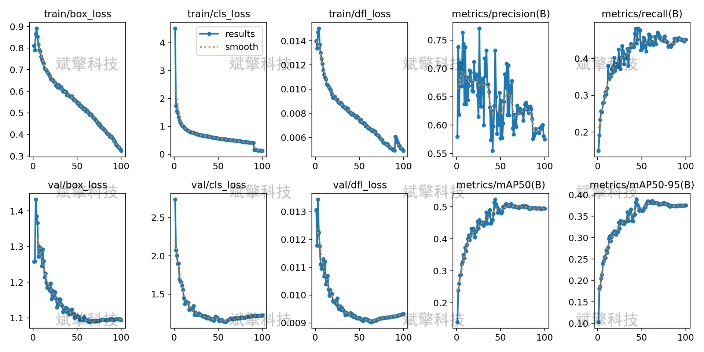
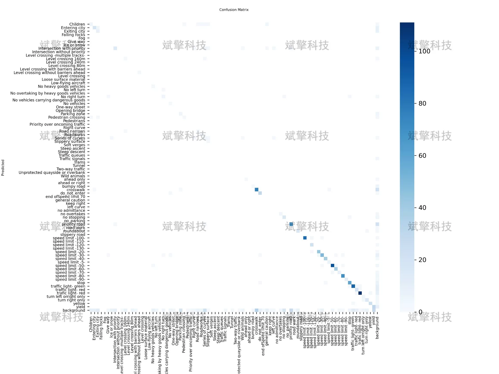
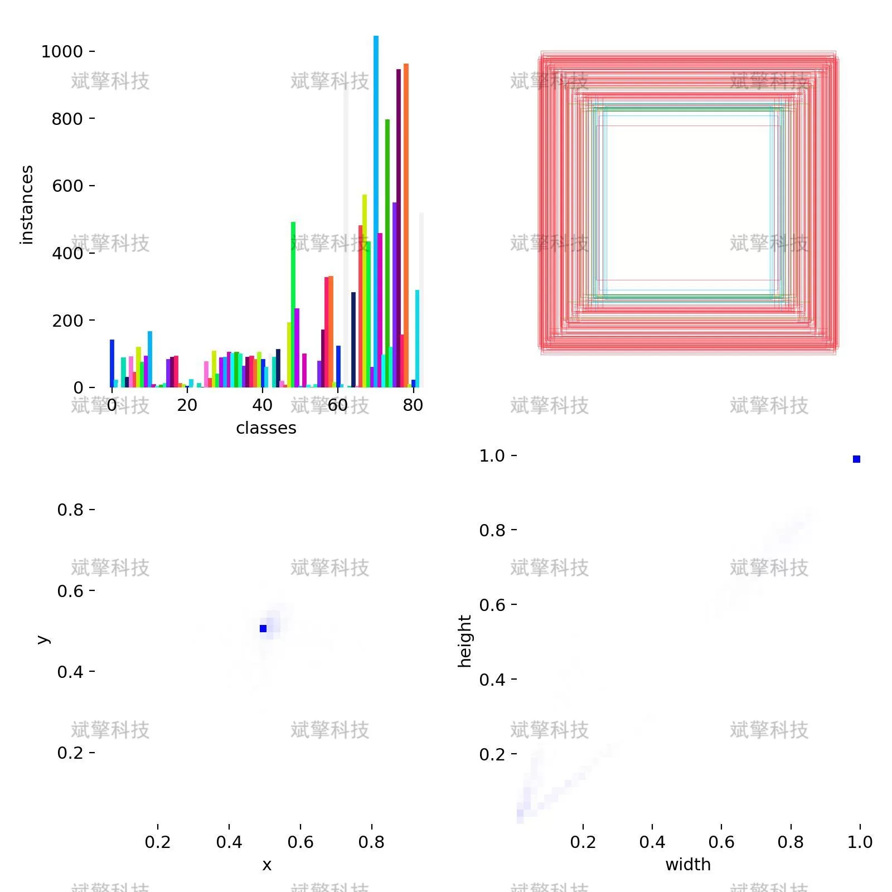
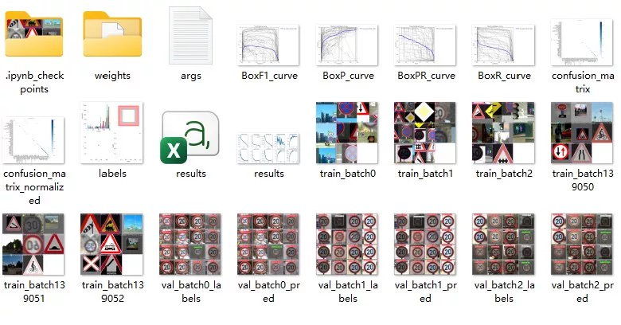
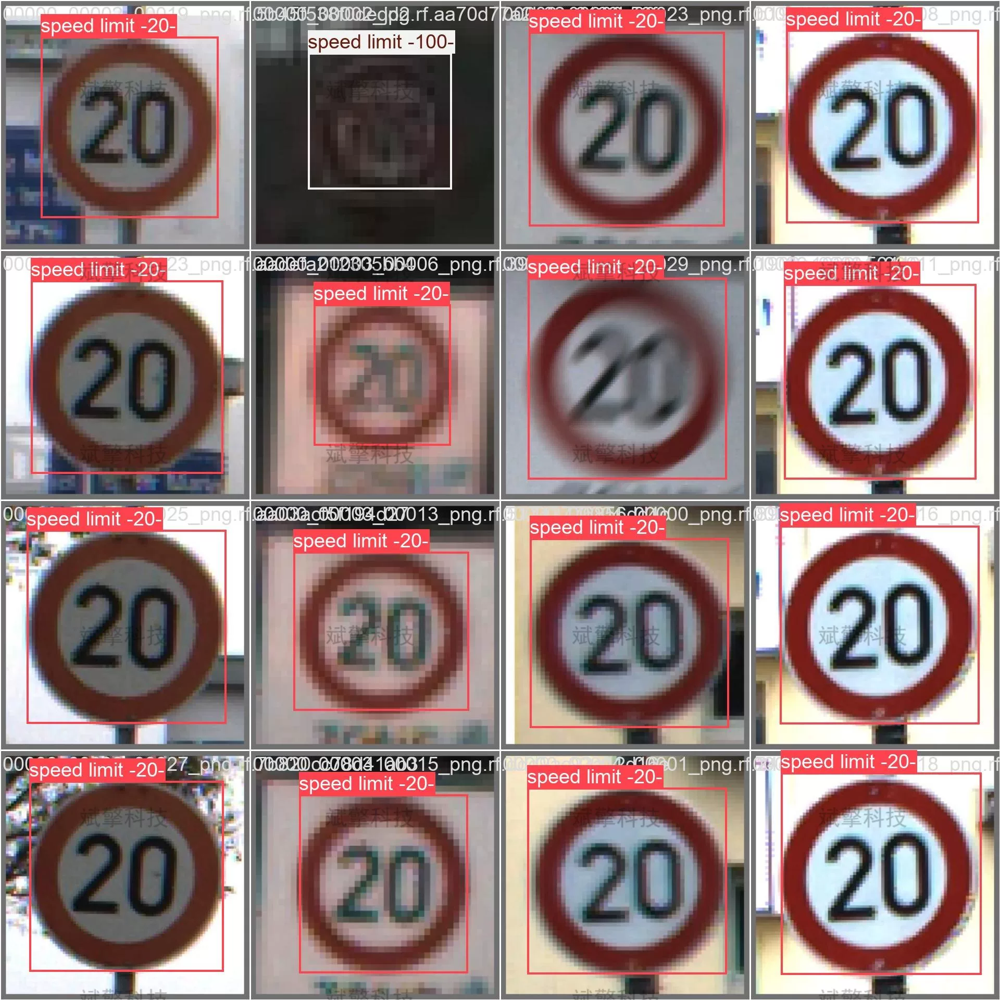
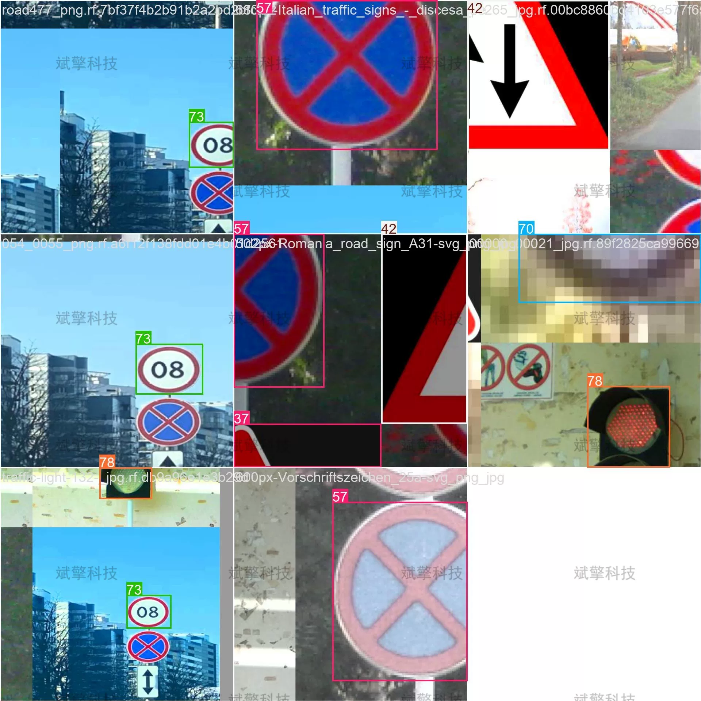

# YOLO26 Traffic Sign Recognition System | UI Interface

## Body

YOLO26 Traffic Sign Recognition System | UI Interface Based on YOLO26 for Traffic Sign Recognition: A Full Process from Training to Test

With the rapid development of intelligent transportation systems and autonomous driving technologies, automatic recognition of traffic signs has become one of the key tasks in environmental perception. This paper constructs a recognition detection system for 83 types of traffic signs based on the YOLO26 (You Only Look Once) object detection algorithm. The system uses 12,356 training images, 1,266 validation images, and 654 test images for model training and evaluation. Experimental results show that the model continuously decreases loss on the training set. This paper analyzes the performance bottleneck of the model and proposes corresponding optimization suggestions, providing references for subsequent improvements in traffic sign recognition systems.

The traffic sign dataset used in this study includes 83 categories, covering common warning signs, prohibition signs, indication signs, and directional signs.
Data Division
Training Set: 12,356 images
Validation Set: 1,266 images
Test Set: 654 images

Free reservation for remote installation. Unsuccessful full refund.
Purchase Enjoy the following resources (auto unlocked in Baidu Pan):
   - YOLO Recognition Detection Project Complete Source Code
   - YOLO format datasets
   - Training code + UI interface code
   - Trained model + result images
   - Software installation package
   - Add WeChat reservation for remote installation (automatically display WeChat ID after purchase) - Unsuccessful, full refund

⚙️ Core Function Modules
Detection Capability
    Image Detection: Upon upload, return detection boxes + category information
    Video Detection: Support video files, precise analysis per frame
    Camera Real-Time Detection: Integrate USB camera, achieve dynamic monitoring
Interaction and Control
    Target Filtering: Choose one or more categories for detection freely
    Parameter Real-Time Adjustment: Adjustable confidence threshold & IoU threshold, flexible control accuracy
    Result Save: One-click save of image/video/camera detection results
System and Data
    User Login and Registration: Support password strength detection + encryption storage
    Log Recording: Automate operation and error information recording (timestamped)

## Images

## Payment

Here is a pay link on Stripe ( https://buy.stripe.com/3cs8yP7sY87d0vu9AB ). Please contact me lonlonago@foxmail.com after funding $89, and I will send you a complete data files , thank you!

